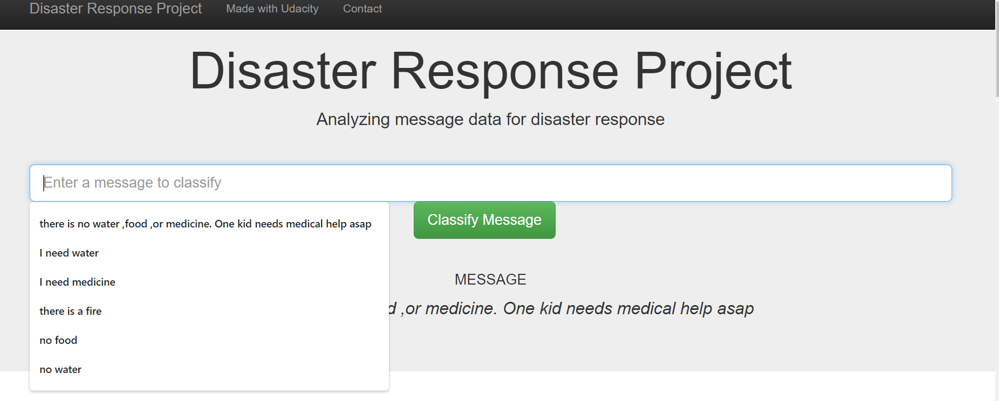
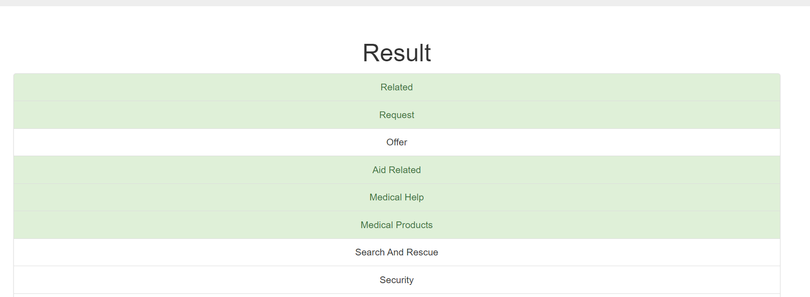

# Disaster_Response_Pipeline
Udacity data science nanodegree project 2

### Table of contents

1. [Libraries used](#Libraries)
2. [Project Inspiration](#Inspiration)
3. [File Descriptions](#files)
4. [How to run this project](#run)
5. [Data Insights](#Insights)
6. [Licensing, Authors, and Acknowledgements](#licensing)


## Libraries used <a name="Libraries used"></a>

Python version 3.0.
dependecies: json, plotly, numpy, pandas, nltk, flask, plotly, sklearn, sqlalchemy, os, sys, re, pickle, argparse

## Project Inspiration<a name="Inspiration"></a>

Apply data engineering skills to expand your opportunities and potential as a data scientist. In this project I analyze disaster data 
from [Figure Eight](https://appen.com/) to build a model for an API that classifies disaster messages. The project will include a [web 
app](https://view6914b2f4-3001.udacity-student-workspaces.com/) where an emergency worker can input a new message and get classification 
results in several categories.


## File Descriptions <a name="files"></a>

*__app__* : template has master.html (main page of web app) and go.html (classification result page of web app), also run.py  (Flask file that runs app)

*__data__* : data files, oringial data are in csv forms, and other database form data are cleaned data

*__models__* : saved model for web app and details of ML in train_classifier.py

*__asset__* : web app screenshot

*__ETL_Pipeline_Prepation.ipynb__* : extract,transfer and load data. Prepared the data for ML analysis, saved data as database instead of csv.

*__ML_Pipeline_Prepation.ipynb__* : serval time consuming ML algorithm process. After considering running time, I use AdaBoost instead of Random forest

*__all.plk__* :  all the ML models I saved, there are 2 random forest model, 2 AdaBoost models


## How to Run <a name="run"></a>

1. The first part of your data pipeline is the Extract, Transform, and Load process. And run ML pipeline to get trained model saved in plk file
```
python data/process_data.py  --messages_filename 
data/disaster_messages.csv --categories_filename 
data/disaster_categories.csv --database_filename 
data/DisasterResponse.db
```

```
python models/train_classifier.py --database_filename 
data/DisasterResponse.db --model_pickle_filename 
models/classifier.pkl
```

2. Once your app is running `python run.py` , if not running, do this `cd app`  then `python run.py`. 
Then open another terminal and type 'env|grep WORK' this will give you the spaceid it will start with view*** and 
some characters after that Now open your browser window and type https://viewa7a4999b-3001.udacity-student-workspaces.com, 
replace the whole viewa7a4999b with your space id you got. Press enter and the app should now run for you


## Insights<a name="insights"></a>

Result web app [here](https://view6914b2f4-3001.udacity-student-workspaces.com/).






## Licensing, Authors, Acknowledgements<a name="licensing"></a>

Data : Figure eight data [here](https://appen.com/)
